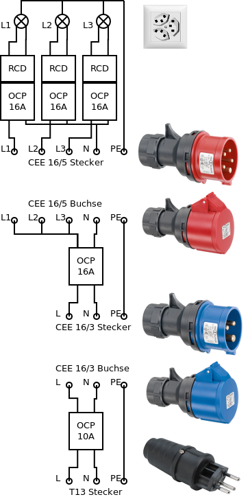

## Aussenanschluss

Als Aussenanschlüsse sollen durch folgende Kaskade von Steckertypen diese Anschlüsse möglich sein:

- [CEE][10] 32/5 (3x 230V/32A), durch einfachen Adapter auf CEE 16/5
- [CEE][10] 16/5 (3x 230V/16A)
- [CEE][10] 16/3 (1x 230V/16A)
- [SEV 1011][11] T13 (1x 230V/10A)

> Die CEE-Stecker 16/5 und 32/5 werden teilweise als 400V-Stecker beschrieben. Das kommt durch die Phasenverschiebung der drei Phasen zustande, jede Phase hat aber zum Neutralleiter 230V, die Phasen können also direkt (ohne Transformation) an die Steckdosen geführt werden (siehe [Wikipedia][10]).

Die Schaltung ist so zu verstehen, dass bei kleineren Anschlüssen die jeweiligen Zwischenstücke (Stecker + Buchse) zusammengehängt werden,
so dass die korrekte Absicherung entsteht.

### Elemente aus der Schaltung

- [T23 3er-Steckdose](https://www.bauundhobby.ch/maschinen-+-werkstatt/elektro-material/kabel-stecker-schalter/steckdosen-+-schalter/up-steckdose-3xt23/C04110110/P4023046/de)
- [OPC 10A](https://www.bauundhobby.ch/maschinen-+-werkstatt/elektro-material/verlegware/sicherungsautomaten/einbauautomat-c-1x10-a/C04110725/P4002315/de)
- [OPC 16A](https://www.bauundhobby.ch/maschinen-+-werkstatt/elektro-material/verlegware/sicherungsautomaten/einbauautomat-c-1x16-a/C04110725/P4002317/de)
- [RCD](https://www.bauundhobby.ch/maschinen-+-werkstatt/elektro-material/elektroinstallation-sonstiges/zubeh%C3%B6r-sicherungen/fi-leitungsschutz-16-a-30-ma-c-2-polig/C04110820/P4002327/de)
- [CEE 16/5 Stecker](https://www.bauundhobby.ch/maschinen-+-werkstatt/elektro-material/verlegware/400-v/stecker-cee-16-5-rot/C04110720/P3194715/de)
- [CEE 16/5 Buchse](https://www.bauundhobby.ch/maschinen-+-werkstatt/elektro-material/verlegware/400-v/cee-wanddose-16-5-rot/C04110720/P3392645/de)
- [CEE 16/3 Stecker](https://www.bauundhobby.ch/maschinen-+-werkstatt/elektro-material/verlegware/400-v/stecker-cee-16-3-blau/C04110720/P3194713/de)
- [CEE 16/3 Buchse](https://www.bauundhobby.ch/maschinen-+-werkstatt/elektro-material/verlegware/400-v/cee-wanddose-16-3-blau/C04110720/P3392644/de)
- [SEV 1011 T13 Stecker](https://www.bauundhobby.ch/maschinen-+-werkstatt/elektro-material/kabel-stecker-schalter/stecker-+-kupplungen/steko-basic-stecker-t12-ip54/C04110115/P4942610/de)

## Innenverkabelung

Alle Leitungen müssen **auf 16A ausgelegt** werden! Es sollten grösstenteils 3er-Steckdosen (siehe oben) verbaut werden, die dann jeweils an die drei
Phase angeschlossen werden. So kann die Lastverteilung im Fall von drei verfügbaren Phasen manuell vorgenommen werden. Wenn nur eine Phase
verfügbar ist, wird sie auf alle Dosen verteilt.

Aufgrund der Energiebilanz (siehe unten) sollten die Phasen in etwa wie folgt verteilt/verwendet werden:

- **L1**: Wichtigste Einbaugeräte, Steckdosen (Radiator, ...)
- **L2**: Küche (ElektroHerd, Mini-Backofen)
- **L3**: Boiler, Steckdosen (Laptop, Kleingeräte, ...)

### Installation

Die Installation sollte vorzugsweise Unterputz vorgenommen werden. Dabei könnten (möglichst wenig tiefe) Einlasskästen (z.B. [diesen 4cm tiefen](https://www.elektro-material.ch/shop/c/L-2211-40-U-2M/p/VA-981806)) verwendet werden. Ich muss
aber noch abklären, ob der mit T12/13-Buchsen (3er) kompatibel ist.

### Spezielles

- Boiler-[Schalter](https://www.bauundhobby.ch/maschinen-+-werkstatt/elektro-material/kabel-stecker-schalter/steckdosen-+-schalter/up-drehschalter-sch0-3-p/C04110110/P4001969/de) in der Küche
- Aus-Timer (ein: manuell; aus: nach *N* Minuten) für Lüftung (Dusche/Klo)
- Teilweise mehrere Lichtschalter für einzelne Lampen

### Zusätzliche leere Rohre

- Zum Dach (falls mal ein Solarpanel installiert wird)
- Zum Wohnraum (für diverse Kabel)

## Energiebilanz

Sollte natürlich nicht alles gleichzeitig laufen.

### Wichtigste Einbaugeräte

| Gerät                         | Verbrauch |
|:------------------------------|----------:|
| [Kühlschrank][4]              |      100W |
| Licht (LED)                   |      150W |
| Wasserpumpe                   |      150W |
| Lüftung Küche/Dusche/Klo      |      100W |

### Sonstige Geräte

Diese Geräte sind im Idealfall auf 3 Phasen aufgeteilt.

| Gerät                         | Verbrauch |
|-------------------------------|----------:|
| [Mini-Backofen][1]            |      600W |
| [Elektroherd (2 Platten)][2]  |     2300W |
| [Boiler][3]                   |     1600W |
| [Radiator als Frostschutz][5] |     1200W |
| Laptop                        |      100W |
| Kleingeraete (Handys etc.)    |       50W |

## Warum kein 12V/DC-Netz

- Einfachere Verkabelung (nicht noch ein Netz)
- Keine gut geeigneten Stecker (Zigarettenanzünder)
- Grosse Verluste bei 12V Netzen über mehrere Meter (schnell grosse Ströme)
- Mehr Standardgeräte einsetzbar

[1]: https://www.amazon.de/Tristar-OV-1430-Mini-Ofen-Einstellbare-Temperatur-100230-Auch-zum-Campen-geeignet/dp/B00RXQJA2S
[2]: https://www.nettoshop.ch/Haushalt-Grossger%C3%A4te/Backen-Kochen-und-Steamen-Grillen/Glaskeramik-und-Kochstellen/Glaskeramik-Rechaud-freistehend/Rotel-2-Platten-Rechaud-Kochstelle/p/IP009028
[3]: https://www.hornbach.ch/shop/Boiler-Pacific-15-Liter-untertisch/5082555/artikel.html
[4]: http://www.severin.de/kuehlen-gefrieren/kuehlschraenke/tischkuehlschrank-ks-9893
[5]: https://www.galaxus.ch/de/s2/product/delonghi-trrs-0920c-heizradiator-5614731?tagIds=40
[10]: https://de.wikipedia.org/wiki/IEC_60309
[11]: https://de.wikipedia.org/wiki/SEV_1011
