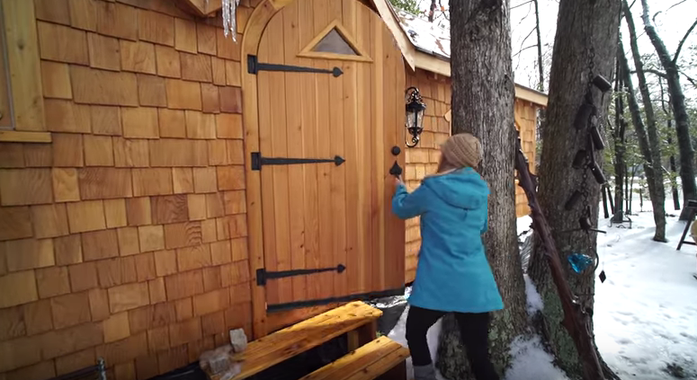

## Dach

Eine Art flaches, lang gezogenes Zwiebeldach aus Kupfer mit kleinen, eckigen Regenrinnen (mit kunstvollen Abflussabschlüssen wenn möglich).

## Fassade

Schindeln:

Vorne und hinten am Wagen wäre es schön, das Dach mit geschwungenen Linien abzuschliessen, in dieser Art.

Um noch ein bisschen mehr Schwung rein zu bringen könnte z.B. an den Ecken eine solche Blende verwendet werden.

## Fenster / Tür

Holzrahmen und auch nicht einfach nur ganz gerade wenn möglich.

## Innenwände

Kombination aus Holzverkleidung, Sichtbälken, Lehmoptik und Weissflächen.

Zudem Platten/Mosaik im Nassbereich (Dusche/Küchenwand).

## Böden

Platten/Mosaik in Küche, Dusche und evtl. beim Ofen. Überall sonst geölter, klassicher Parkett (z.B. Fischgrat).

## Bett/Sofa

Erhöhter Bett/Sofa-Bereich mit Stauraum unterhalb

